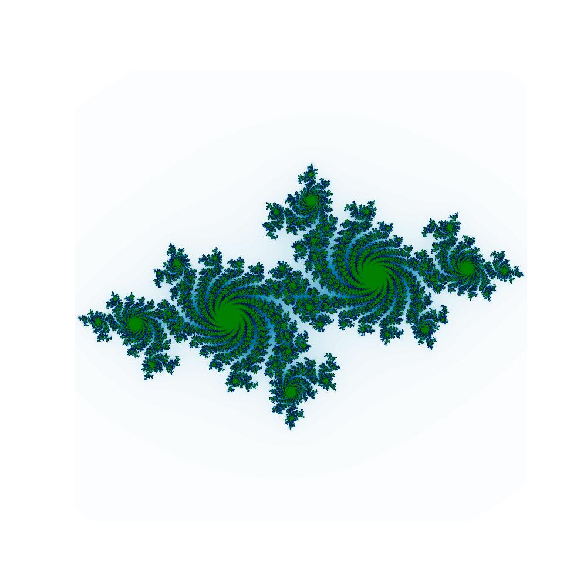

# julia-sets
Small Python program that draws Julia Sets

## Installation
```bash
pip install -r requirements.txt
```

## Usage
```bash
python main.py
```
## Examples
On the wiki page there are several complex numbers to use.

c = -0.7 + 0.27015i


c = 0.285 + 0.01i


Live image

